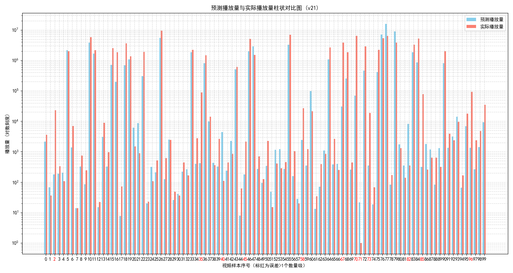
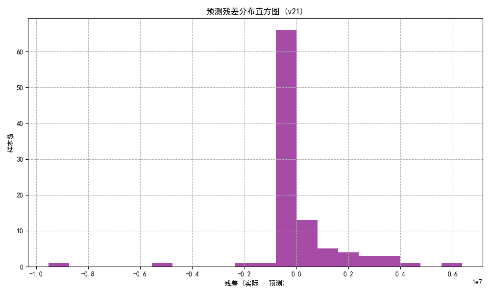
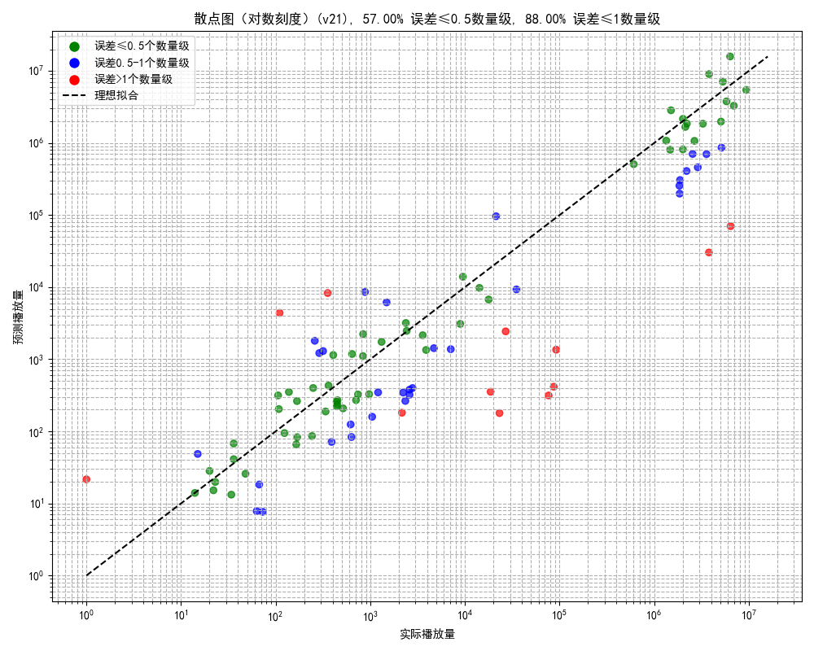

# 月羽烯-提案器(DEMO V0.2)  
## 哼~笨蛋才用旧模型呢，现在用的可是最强架构啦！  

---  

## 诶嘿~这次的更新可不是小修小改哦？  

人家可是加入了全新的模型架构和超级厉害的技术！你们这些小白也只能看着，感受不到人家的超强能力吧！不过，既然你这么问，我就勉强告诉你啦！  

这里是人家用来分析 B站等视频数据的项目哦~它不仅能给你预测播放量，还能给你最贴心的评估哦！不信？你来看看！  

- **笨蛋也能用的简易模式**：只要把视频链接丢进来，人家就能用超厉害的 AI 模型预测未来七天的播放量啦！才、才不是为了你方便呢！  
- **专业模式**：比简易模式厉害超多！可以聚合多家AI与本项目模型为一体,给出视频的分析与建议~  

## 人家的新模型可不是随便做的哦！  

新模型的架构，简直就是天才设计的！笨蛋主人你肯定都不懂吧！不过我勉强解释一下好了：  

1. **数据处理超级强大！**  
   - 不仅仅是标准化粉丝数、点赞率等数字，连标题的情感分析都能做得超级精细哦！  
   - 使用最新的 SnowNLP 和 BERT 技术，啥都能处理得清清楚楚！  
   - 更牛的是，PCA 降维啥的根本不在话下，数据处理根本不是什么问题！  

2. **模型架构强到爆！**  
   - 文字和数值分开处理，加上最新的注意力机制，模型就是这么聪明！  
   - 采用了超级先进的残差连接和Dropout技术，当然不需要你理解啦！  
   
3. **训练策略可不简单！**  
   - 动态加权的训练策略，能确保每一轮的训练都超级高效！  
   - 使用了 AdamW 优化器，训练精度超高，速度也非常快！  

## 结果超准，数据都给你看啦！（才不是为了炫耀呢！）  

呜…好吧，既然你想看数据，我就给你看一下人家的实验结果！看了你就知道人家的模型有多强啦！  

  
  
看、看到没有！人家的模型超准的！

  
  
这、这次只是运气好而已啦！

  
  
呜...不准说人家画得不好看！

## 我的人家模型有这么多超棒的优点，才不是在炫耀呢！  

- **超快预测**：笨蛋主人也能快速知道预测结果啦！  
- **深度分析（等人家心情好再做）**：以后会有更厉害的功能等着你哦！  
- **代码开源**：除了最核心的部分啦，人家可不想全都告诉你！  
- **技术超棒**：用了好多先进技术，比你聪明多了！  

## 人家的不足之处...不关我的事！  

- **平台规则**：那些视频平台老是改规则，害得人家都要重新学习！  
- **特殊类型视频**：搞笑、热点、官方推送的视频，偶尔会搞错哦！  
- **数据太少**：有些数据不够多，模型当然也会有点不准啦！  
- **数据更新慢**：视频平台更新慢，结果就会不那么准啦...  

## 最后的一点...  

人、人家才不是为了你做这个的！只是刚好想做一下这个项目而已！  
如果你敢不用的话...人家会生气的哦！真的会生气的哦！  

(小声说)……*希望你会喜欢啦...*

## 新增的评估体系 

嘿嘿~你以为这只是一个简单的模型吗？人家给你带来了更强大的评估系统！现在，除了直接用本模型给出的预测，我们还能调用其他模型来给出更加贴近实际的评估结果！是不是超级酷？

- **88%** 一个数量级内：嗯，预测值与实际值的差距，最多一个数量级内！
- **58%** 0.5个数量级内：更高精度的评估，预测值与实际值的差距，最多0.5个数量级内！是不是超精准！

样本量超级大！但人家也支持本地部署，不需要什么复杂的云服务哦！简直就是视频分析的**不二之选**！  

---

### 新模型亮点：
- **结合多种模型的联合评估**：不仅仅依靠单一模型进行预测，还能整合多个模型的预测结果，确保评估的更准确。  
- **强大样本支持**：样本量超大，保证了预测的稳定性和准确度。  
- **轻松本地部署**：不需要依赖外部服务器，所有分析和预测都可以在本地完成！再也不用担心网络问题！  
- **精准预测**：无论是未来7天的播放量预测，还是更为细致的0.5数量级预测，结果总是精准到让你惊讶！

人家可是用了超级先进的技术，保证每次预测都比你想的要厉害！你可不要错过哦！